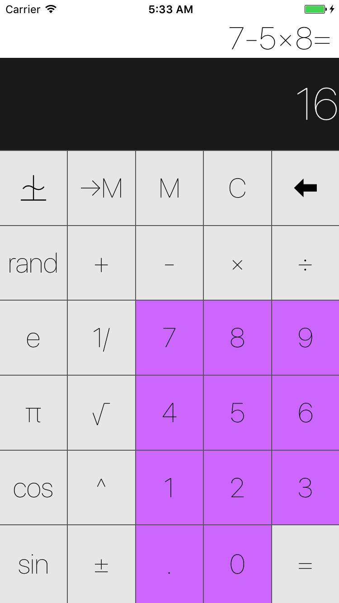
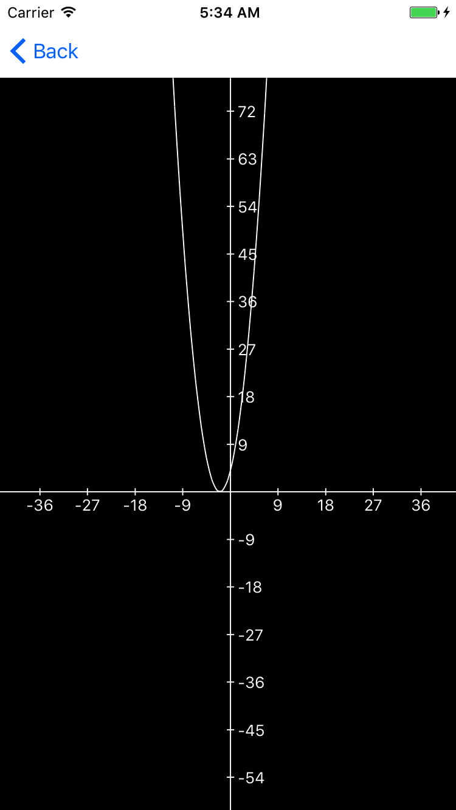
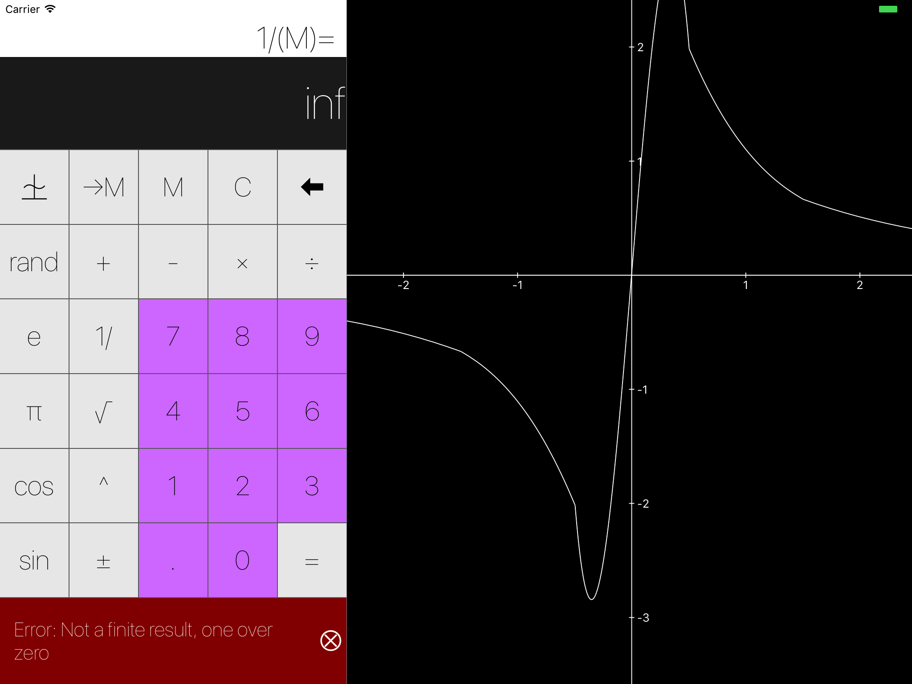

 <h1>Calculator Project</h1> 

	  
	<a href="https://github.com/igavrysh/Calculator">Calculator Project</a> is one of my try Swift projects. Requirements were taken from Stanford course on iOS 10 programming  

# Features
* basic math operations
* C-clear and backspace buttons
* random operation
* description label which indicates how the result shown on a display is derived
* unit tests and UI tests
* Circle CI/Travis CI integration for running tests
* operand types: .variable and .value
* undo operation
* long press on ->M button shows the value of inputed variable
* graphs
* errors processing
* last operation / graph zoom settings storage

